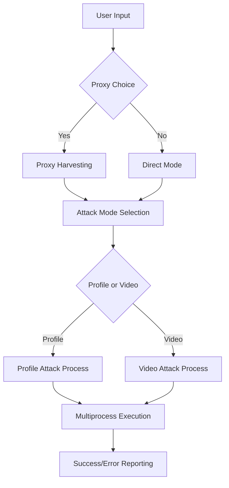

# 🎯 Instagram Account Reporter Tool by rhyugen

<div align="center">

**🚀 Advanced Instagram Content Reporting Automation Tool**

[](https://python.org)
[](LICENSE)
[](https://github.com/rhyugen/InstaReporter)

</div>

---

## 🌟 Features

### 🎯 **Dual Attack Modes**
- **Profile Reporting**: Target specific Instagram user profiles
- **Video Content Reporting**: Report individual video posts

### ⚡ **High-Performance Architecture**
- **Multiprocessing Engine**: Up to 5 concurrent processes for maximum efficiency
- **Smart Load Distribution**: Automatic proxy chunking (10 proxies per process)
- **Intelligent Fallback**: No-proxy mode with 10 requests per process

### 🛡️ **Advanced Anonymity System**
- **Dynamic Proxy Support**: Built-in proxy harvesting from internet sources
- **Custom Proxy Lists**: Support for user-provided proxy files (max 50)
- **User Agent Rotation**: 90+ realistic browser user agents
- **Protocol Intelligence**: Automatic HTTP/HTTPS proxy configuration

### 🎨 **Professional User Interface**
- **Colorized Console Output**: Beautiful terminal interface with status indicators
- **Real-time Progress Tracking**: Live transaction monitoring
- **Error Handling**: Comprehensive error reporting with detailed diagnostics

---

## 🚀 Quick Start

### Prerequisites

```bash
# Python 3.7 or higher required
python --version
```

### Installation

1. **Clone the repository**
```bash
git clone https://github.com/rhyugen/InstaReporter.git
cd InstaReporter
```

2. **Install dependencies**
```bash
pip install requests colorama asyncio proxybroker
```

3. **Run the application**
```bash
python InstaReporter.py
```

---

## 📋 Usage Guide

### 🎯 **Interactive Mode**

The application provides an intuitive step-by-step interface:

1. **Proxy Configuration**
   - Choose to use proxies or run without them
   - Auto-harvest proxies from the internet
   - Or provide your own proxy list file

2. **Attack Mode Selection**
   - `1` - Report Instagram profiles
   - `2` - Report Instagram videos

3. **Target Specification**
   - Enter the username (for profiles)
   - Enter the video URL (for videos)

### 📁 **Proxy File Format**

Create a text file with one proxy per line:
```
proxy1.example.com:8080
proxy2.example.com:3128
192.168.1.100:8080
```

---

## 🏗️ Architecture Overview

### 🔧 **Core Components**

- **Main Orchestrator** (`InstaReporter.py`): Process management and user interaction
- **Attack Engine** (`libs/attack.py`): HTTP request handling and form submission
- **Proxy Harvester** (`libs/proxy_harvester.py`): Automatic proxy discovery
- **Utility Suite** (`libs/utils.py`): Console interface and file operations

### 🔄 **Workflow Architecture**



---

## ⚠️ Legal Disclaimer

This tool is designed for **educational and research purposes only**. Users are responsible for:

- ✅ Complying with Instagram's Terms of Service
- ✅ Following local and international laws
- ✅ Using the tool ethically and responsibly
- ❌ Not engaging in harassment or malicious activities

**The developers assume no responsibility for misuse of this software.**

---

## 🤝 Contributing

We welcome contributions! Here's how you can help:

1. **🍴 Fork the repository**
2. **🌿 Create a feature branch** (`git checkout -b feature/amazing-feature`)
3. **💾 Commit your changes** (`git commit -m 'Add amazing feature'`)
4. **📤 Push to the branch** (`git push origin feature/amazing-feature`)
5. **🔄 Open a Pull Request**

---

## 📞 Support & Contact

<div align="center">

**👨‍💻 Producer: rhyugen**

</div>

---

## 📄 License

This project is licensed under the **Educational License** - see the [LICENSE](LICENSE) file for details.

---

<div align="center">

**⭐ If this project helped you, please give it a star! ⭐**

*Modified by rhyugen*

</div>

